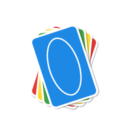
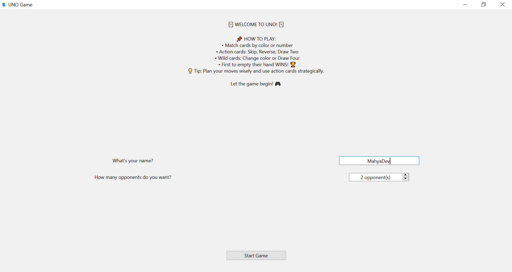
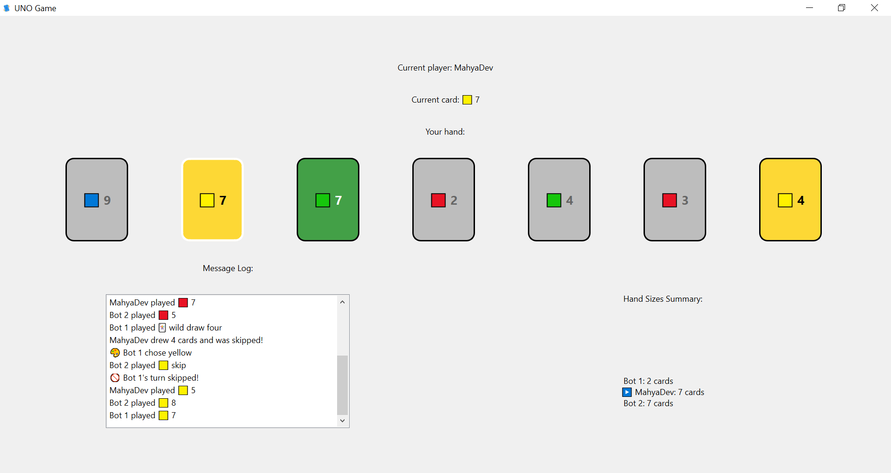
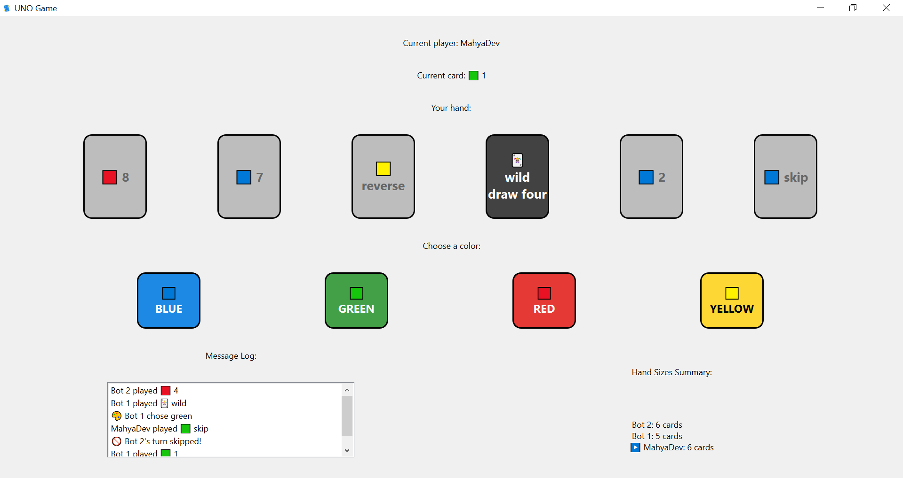
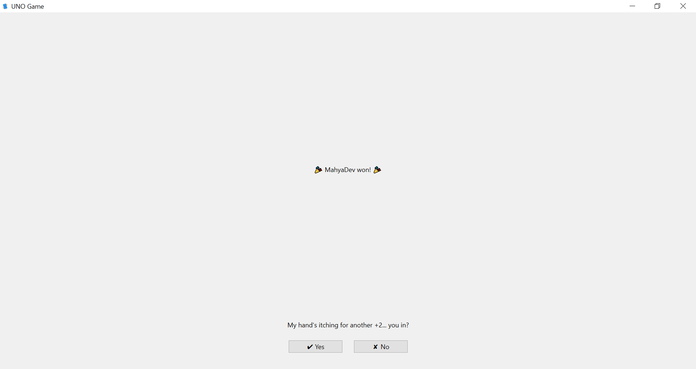

<p align="center">
  
</p>

<h1 align="center">🃏 UNO Game</h1>

<p align="center">
A Python implementation of the classic UNO card game, built with Object-Oriented Programming (OOP) principles — playable through a PySide6 graphical interface.
</p>

## 📖 About the Project

This project started as a console-based implementation of UNO in Python, with core mechanics fully playable through a command-line interface. It has since grown a **PySide6 desktop GUI**, built on top of the same underlying game logic — no rewrite required, thanks to a clean separation between game rules and I/O.

It also includes a heuristic-based AI opponent that makes context-aware decisions instead of choosing playable cards randomly.

> **Looking for the original terminal-only version?**
> It's preserved in git history under the [`terminal-only`](../../tree/terminal-only) tag. Check it out with `git checkout terminal-only` to play the pre-GUI version from the command line.

## 📸 Screenshots

<table align="center">
  <tr>
    <td align="center"><b>Welcome</b></td>
    <td align="center"><b>Gameplay</b></td>
    <td align="center"><b>Winner</b></td>
  </tr>
  <tr>
    <td></td>
    <td align="center">
      
      
    </td>
    <td></td>
  </tr>
</table>

## 🗂️ Project Structure

```text
.
├── main.py                  # Entry point — launches the PySide6 GUI
├── assets/
│   ├── icons/
│   │   └── icon_256.png
│   └── screenshots/
│       ├── screenshot_welcome.png
│       ├── screenshot_gameplay1.png
│       ├── screenshot_gameplay2.png
│       └── screenshot_winner.png
├── gui/
│   ├── main_window.py       # Top-level window, screen switching
│   ├── welcome_widget.py    # Player name & opponent count setup
│   ├── game_widget.py       # Card display, message log, hand summary
│   ├── game_controller.py   # Bridges GameWidget clicks <-> Game logic
│   └── winner_widget.py     # End-of-game screen, play-again prompt
└── uno/
    ├── card.py               # Card, NumberCard, ActionCard, WildCard
    ├── deck.py                # Deck creation, shuffling, draw/discard
    ├── player.py               # Player (abstract), HumanPlayer, BotPlayer
    ├── game.py                 # Turn flow, card effects, win detection
    ├── game_setup.py           # Builds a shuffled human + bot player list
    └── turn_context.py         # Context passed to bots for decision making
```

## ✨ Current Features

### 🎴 Card System
- Card representation
- Number, Action, and Wild cards
- Card colors and values
- Card validation
- Playability rules

### 🂠 Deck Management
- Standard 108-card UNO deck generation
- Deck shuffling
- Drawing cards
- Discard pile management
- Automatic discard pile recycling

### 👤 Players
- `HumanPlayer` — decisions come from the GUI
- `BotPlayer` — heuristic-based AI, no external input required
- Hand management, drawing, playing
- Strategic Wild card color selection
- UNO call detection

### 🤖 Bot Strategy

The bot uses a heuristic scoring system to evaluate all playable cards and selects the highest-scoring move instead of making random choices.

Current decision factors include:

- Card type
- Color and value matching
- Dominant color in hand
- Duplicate cards
- Late-game Wild card usage
- Next-player hand size awareness for more strategic Action and Wild card usage

### 🎮 Game Logic
- Stepwise turn flow (`start_turn` → `draw_and_check` → `play_turn`) that reports events as returned messages instead of printing directly
- Turn context abstraction for player decision making
- Polymorphic player system
- Player rotation
- Action card effects
- Wild card effects
- Win detection

### 🖥️ Graphical Interface (PySide6)
- Welcome screen for name & opponent count
- Clickable hand — only legal moves are enabled
- Color picker for Wild cards
- Live message log of game events
- Live hand-size summary for all players
- Winner screen with a "Play Again" prompt
- Custom app icon and taskbar identity

## 🚀 Getting Started

```bash
pip install PySide6
python main.py
```

## 🛠️ Technologies

- Python 3
- PySide6 (Qt for Python)
- Object-Oriented Programming (OOP)

## 🎯 Learning Goals

This project was part of my learning journey to improve my skills in:

- Object-Oriented Programming (OOP)
- Python
- Software design & separation of concerns
- Event-driven programming (Qt signals/slots)
- Desktop GUI development
- Heuristic algorithms
- Git and GitHub workflow

## 📌 Project Status

✅ **v1.0** — Complete. The game is fully playable from start to finish, with a working AI opponent and a graphical interface.

I'm moving on to new projects, but I'll occasionally revisit this one to polish it further.
